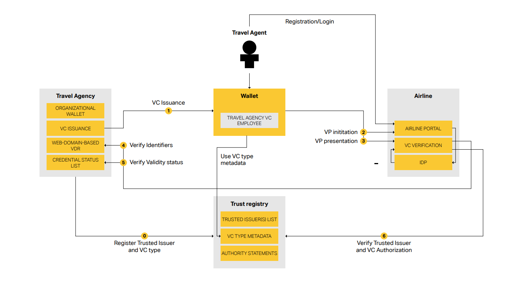

# Decentralized Identity in Aviation - Project 777  
*Using Verifiable Credentials for Travel Agency Employee Identity Verification*

## Overview
Project 777 is a Business-to-Business (B2B) PoC that tackles identity management and fraud prevention in the travel industry. By leveraging Digital Employee IDs, the solution provides both travel agents and airlines with a secure and efficient identity framework, reducing fraud and streamlining the onboarding process.

## Scope
This Proof of Concept (PoC) validates seven key workflows demonstrating how Digital Identity and Verifiable Credentials (VCs) can enhance travel agency employee authentication and onboarding across multiple airline B2B portals.

The PoC integrates:
- Credential issuance and revocation by travel agencies.
- Mobile and web wallets for storing and presenting credentials by travel agents.
- VC verification services from multiple independent technology providers integrated in Airline Agency portals.

| # | Workflow | Description |
|---|----------|-------------|
| 1 | Agent Digital Employee ID Issuance | Travel agency issues verifiable credentials for agents. |
| 2 | Agency Registration (not all airlines use it) | Application form is automatically generated from digital wallet attributes. |
| 3 | Agency Approval (not all airlines use it) | Automatic approval triggered if the agent's digital identity is linked to a registered partner agency. |
| 4 | User Self-Registration in Airline Portal | Upon first login, agent information is automatically presented to the airline, and an agent profile is created instantly. |
| 5 | Agent Authentication via Mobile App | Agent logs in to the airline portal using mobile-based authentication. |
| 6 | Agent Authentication via Desktop App | Agent logs in to the airline portal using desktop-based authentication. |
| 7 | Agent Digital ID Revocation | Travel agency revokes the agent's digital credential if needed. |

## Decentralized Identity Implementation & Standards

This PoC leverages decentralized identity standards to ensure a robust and secure digital identity ecosystem. By using these standards, the system can maintain a trusted network of issuers, holders, and verifiers while preserving data privacy and security.

### Interop Profile

This Proof of Concept (PoC) has developed and implemented an Interoperability Profile as a central approach to implementing decentralized digital identity standards across different technology providers.

The table below summarizes the different standards used in this PoC:

| **Component** | **Standard** | **Purpose** |
|--------------|-------------|-------------|
| **VC issuance** | [OpenID for Verifiable Credential Issuance (Implementors Draft v1)](https://openid.net/specs/openid-4-verifiable-credential-issuance-1_0-ID1.html) | Defines how an Issuer and a Wallet perform the issuance flow (pre-authorized code flow, credential offer/response). |
| **Holder binding** | SD-JWT VC | Ensures the Verifiable Credential is bound to the holder’s wallet. |
| **VC presentation** | [OpenID for Verifiable Presentations (OID4VP 20)](https://openid.net/specs/openid-4-verifiable-presentations-1_0-20.html) | Describes how a Holder presents credentials (Verifiable Presentations) to a Verifier, including request and response flows. |
| **Data format and validation rules to express VC** | [SD-JWT VC (draft-ietf-oauth-sd-jwt-vc-07)](https://datatracker.ietf.org/doc/html/draft-ietf-oauth-sd-jwt-vc-07) | Enables selective disclosure and cryptographic binding of claims in a Verifiable Credential. |
| **VC Revocation** | [OAuth 2.0 Credential Status List (draft-ietf-oauth-status-list-05)](https://datatracker.ietf.org/doc/html/draft-ietf-oauth-status-list-05) | Defines a status list mechanism for revocation checks (active/revoked) so Verifiers can ascertain a credential’s validity. |
| **Decentralized Identifiers** | [did:web](https://w3c-ccg.github.io/did-method-web) | Specifies a method for hosting DID documents on HTTPS web domains, enabling domain-based DID resolution for key material. |
| **Cryptographic Suites** | P-256 (secp256r1), ES256 (JWT) | Establishes Elliptic Curve Digital Signature (ECDSA) requirements for signing and signature validation (SHA-256 hashes). |
| **Trust Registry** | Ad-hoc | Enable airlines to implement validation policies that ensure only trusted airlines, banks, commercial partners issuers and authorized credentials are accepted in the ecosystem. |

## Component Implementation Overview

Based on the interoperability profile, multiple independent implementations have been developed to demonstrate interoperability within a standards-based setup. The components include:

| **Component**     | **Implementation**                                                                                                     |
|-------------------|------------------------------------------------------------------------------------------------------------------------|
| **Issuer**        | Facephi and Neoke                                                                                          |
| **Wallet**        | Facephi and neoke mobile wallets and web-based  wallet (SICPA and Facephi)                                         |
| **Verifier**      | Facephi, Neoke, SICPA and 4sure Technologies                                                                                           |
| **Trust Registry**| 4sure Technologies                                                                                                   |

## Ecosystem Blueprint

The ecosystem blueprint illustrates how travel agencies issue credentials to their employees and how airlines verify these credentials during interactions. 

Key components include:

- **Travel Agency:**  
  - **VC Issuance:** Creation and issuance of Employee VCs.  
  - **Web-Domain-Based VDR:** Anchors the travel agency’s DID to a controlled web domain.  
  - **Credential Status List:** Maintains the validity and revocation status of issued credentials.

- **Travel Agent & Wallet:**  
  Travel agents receive Employee VCs in either mobile or web-based digital wallets, which are then used for secure, instantaneous verification during the airline onboarding or login process.

- **Airline:**  
  - **Airline Portal & IDP:** Consume VCs during the travel agent’s login or registration process.  
  - **VC Verification Service:** Validates credential integrity and issuer trustworthiness, checking against the Credential Status List and Trust Registry.

- **Trust Registry:**  
  Maps the issuer’s DID to their IATA code and contains the metadata, schemas, and type definitions for credentials—ensuring uniformity and trust across the ecosystem.

## Prerequisites

Before issuing and managing Verifiable Credentials, travel agencies must be fully provisioned:

- **Signing Keys:** Cryptographic keys are generated and associated with the issuer.
- **DID and DID Document:** A DID using the did:web method is anchored, with a DID Document (containing the agency’s public keys and metadata) accessible online.
- **Trust Registry Registration:** The Travel Agency must register with the Trust Registry by adding its DID and IATA code to the Trusted Issuers List and requesting credential issuance authority.

## Process Steps

The following high-level steps outline the process within the ecosystem:

| **Step**                               | **Description**                                                                                                                                                                                                                                   |
|----------------------------------------|---------------------------------------------------------------------------------------------------------------------------------------------------------------------------------------------------------------------------------------------------|
| **Step 0: Register Trusted Issuer and VC Type** | - The Travel Agency registers with the Trust Registry.  - Its DID and IATA code are added to the Trusted Issuers List, and credential issuance authority is granted.                                                             |
| **Step 1: VC Issuance**                | - The Travel Agency issues a Verifiable Credential to the Travel Agent’s wallet.  - The credential is cryptographically signed using the agency’s private key and includes a status claim that points to the Credential Status List.     |
| **Step 2: VP Initiation**              | - When a Travel Agent wants to access the Airline’s B2B portal, the Airline Portal displays a QR code containing a proof request URL.  - The Travel Agent scans the QR code or manually enters the URL to initiate the VP process.    |
| **Step 3: VP Presentation**            | - The Travel Agent’s wallet prepares a Verifiable Presentation (with selective disclosure) and sends it to the Airline’s verification service.                                                                                                   |
| **Step 4: Verify Verifiable Presentation** | - The Airline’s verification service resolves the issuer’s DID using the did:web method.  - It retrieves the issuer’s DID Document to access the associated public key and then cryptographically verifies the VP.                     |
| **Step 5: Verify Credential Status**   | - The verification service consults the Credential Status List (referenced in the VC) to confirm whether the credential is active or revoked.                                                                                                   |
| **Step 6: Verify Trusted Issuer Type** | - The service checks that the issuer’s DID is in the Trusted Issuers List and that the Travel Agency is authorized to issue the credential type by consulting the Trust Registry.  - Upon successful validation, the airline proceeds. |
s.
