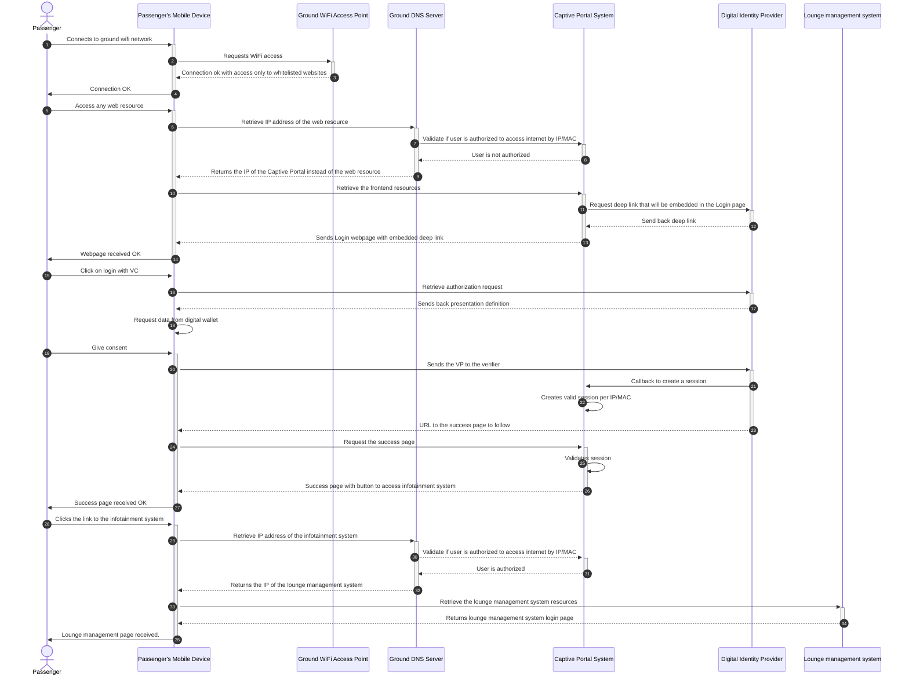
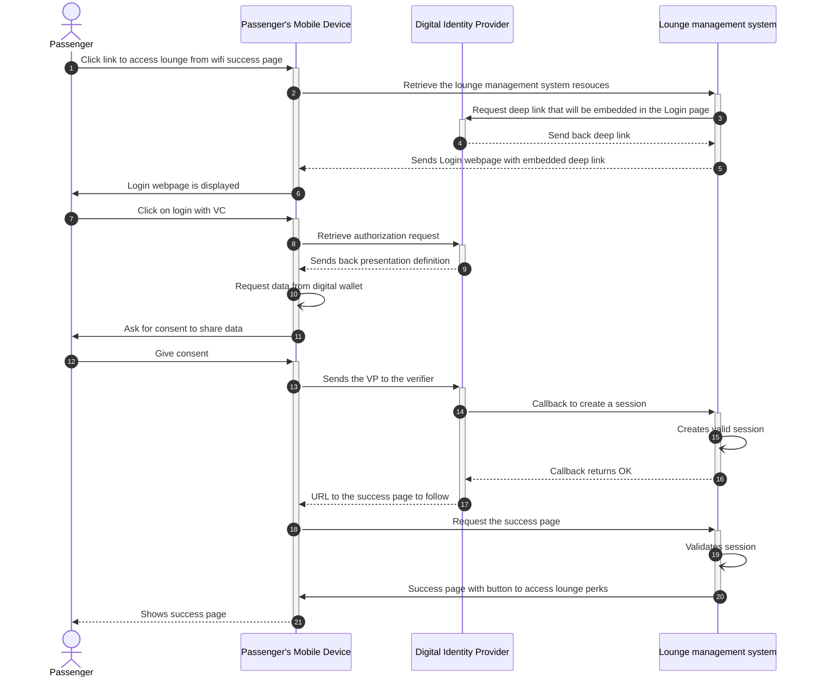
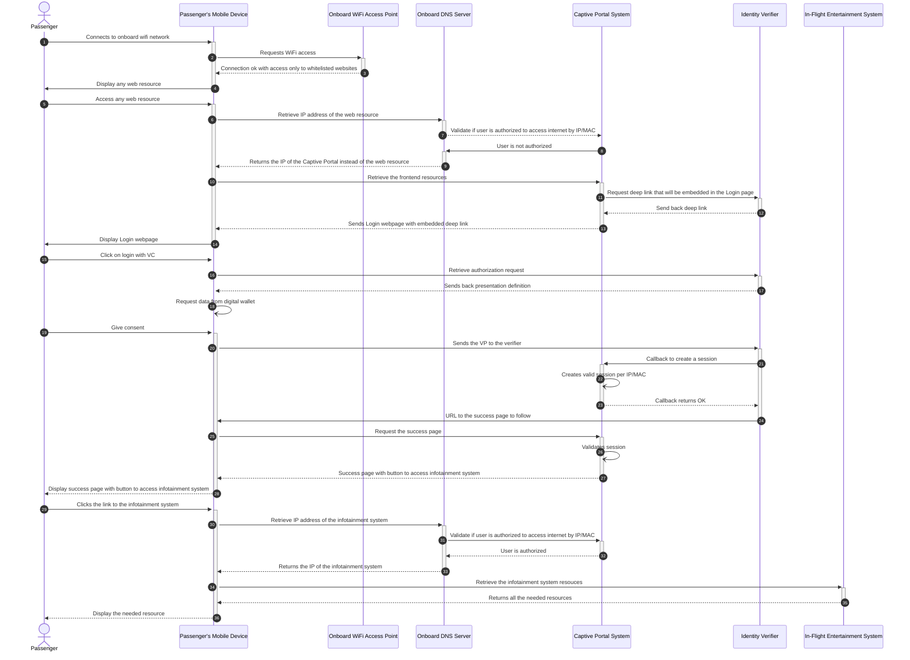
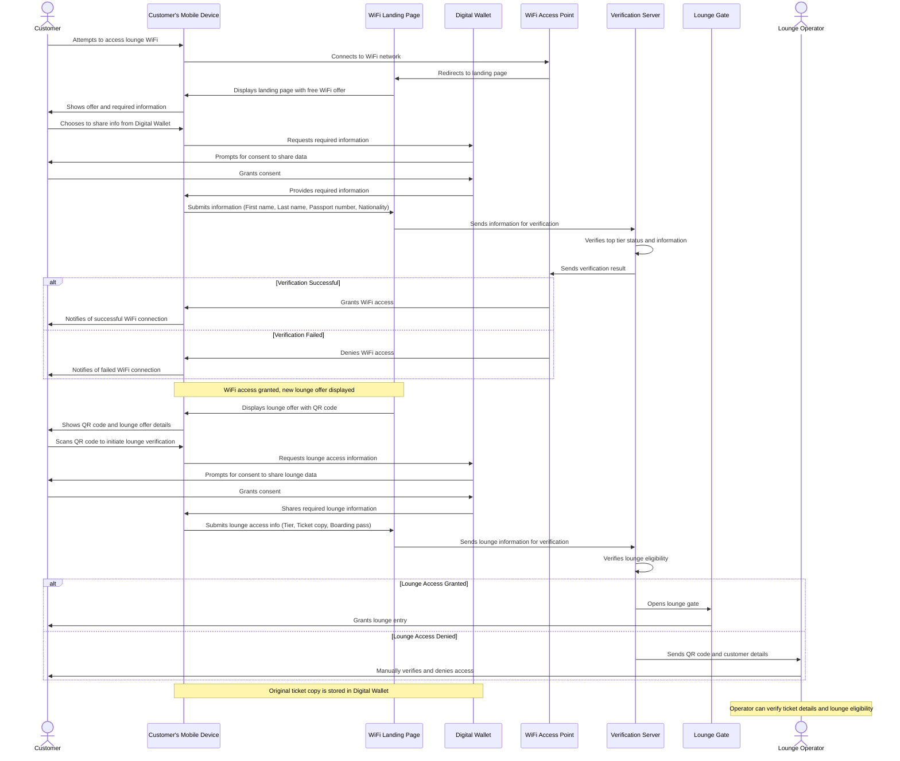

# Digital Identity B2C - FQTV Tier Mutual Recognition and Verification System  
*Using Verifiable Credentials for Seamless Passenger Authentication*

## Overview

Project 321 is a Business-to-Customer (B2C) Proof of Concept (PoC) that enhances the passenger experience by allowing secure and seamless access to airline lounges and onboard services using Verifiable Credentials (VCs) and Digital Wallets. The project explores how digital identity solutions can improve frequent flyer program interactions, reduce inefficiencies, and create a frictionless, privacy-preserving passenger journey.

# Scope
This Proof of Concept (PoC) validates key workflows demonstrating how digital identity and verifiable credentials (VCs) can enhance passenger access to airline services, including:

- Wi-Fi Authentication :Enabling frictionless access using verified identity attributes
- Lounge Entry : Automating entitlement verification based on loyalty status and ticket class
- Entitlement Management  : Ensuring precise, automated validation of passenger privileges across multiple airline partners and service providers

The PoC consists of two main use cases:

- Lounge Access Verification
- Wi-Fi Access  Onboard/In-Cabin

## Lounge Access Verification
| Step | Description |
|------|-------------------------------------------|
| 1. | Passenger selects Lounge Access on the Wi-Fi welcome page. |
| 2. | System requests boarding pass & Frequent Flyer (FFP) credentials. |
| 3. | Passenger shares credentials from Digital Wallet. |
| 4. | System verifies eligibility (ticket class, frequent flyer tier, entitlements). |
| 5. | Access approved, system generates a QR code for lounge entry. |

## Wi-Fi Access Onboard/In-Cabin
| Step | Description |
|------|-------------------------------------------|
| 1. | Passenger selects Wi-Fi network onboard. |
| 2. | Wi-Fi captive portal opens, requesting passport & FFP details. |
| 3. | Passenger shares credentials from Digital Wallet (or enters manually). |
| 4. | System verifies identity & entitlements using a trust registry. |
| 5. | Wi-Fi access granted, passenger is redirected to the welcome page. |

## Decentralized Identity Implementation & Standards

 **Issuer(s)**
Airlines, immigration authorities, or trusted government 
bodies issue Verifiable Credentials (VCs) (e.g boarding
passes, loyalty status, or passport-derived credentials) to
passengers.

**Holder(s)**
Passengers securely store their VCs in a Digital Identity
Wallet (e.g., mobile driver’s license wallets or airlinebranded apps) and selectively present them during checkin, lounge access, or Wi-Fi authentication.

**Verifiers(s)**
Airlines, airports, lounges, and onboard service providers 
validate Verifiable Presentations (VPs) to confirm eligibility
(e.g., lounge access, Wi-Fi entitlements). By leveraging
Verifiable Credentials, they can verify eligibility by
cryptographically checking the integrity and authenticity 
of the VPs while minimizing unnecessary personal data 
exposure through selective disclosure.

**Verifiable Data Registry(s)**
Maintains identifiers and status information needed to
verify the validity and revocation status of Employee VCs,
based on each travel agency’s web domain. Each travel
agency manages its own web-domain-based VDR.

**Trust Registry**
The Trust Registry maintains VC type metadata, schemas,
a trusted list of issuers, and credential issuance authority 
statements. VC type metadata and schemas define the
rules, structure, and display requirements for specific
types of Verifiable Credentials (VCs), guiding issuers,
verifiers, and wallets on how to handle and validate
credentials. The trusted list of issuers and credential 
issuance authority statements supports airlines (verifiers)
by enabling them to implement validation policies that 
ensure only trusted travel agency issuers and authorized 
credentials are accepted. 

### Interop Profile

This Proof of Concept (PoC) has developed and implemented an Interoperability Profile as a central approach to implementing decentralized digital identity standards across different technology providers.

The table below summarizes the different standards used in this PoC:

| **Component** | **Standard** | **Purpose** |
|--------------|-------------|-------------|
| **VC issuance** | [OpenID for Verifiable Credential Issuance (Implementors Draft v1)](https://openid.net/specs/openid-4-verifiable-credential-issuance-1_0-ID1.html) | Defines how an Issuer and a Wallet perform the issuance flow (pre-authorized code flow, credential offer/response). |
| **Holder binding** | SD-JWT VC | Ensures the Verifiable Credential is bound to the holder’s wallet. |
| **VC presentation** | [OpenID for Verifiable Presentations (OID4VP 20)](https://openid.net/specs/openid-4-verifiable-presentations-1_0-20.html) | Describes how a Holder presents credentials (Verifiable Presentations) to a Verifier, including request and response flows. |
| **Data format and validation rules to express VC** | [SD-JWT VC (draft-ietf-oauth-sd-jwt-vc-07)](https://datatracker.ietf.org/doc/html/draft-ietf-oauth-sd-jwt-vc-07) | Enables selective disclosure and cryptographic binding of claims in a Verifiable Credential. |
| **VC Revocation** | [OAuth 2.0 Credential Status List (draft-ietf-oauth-status-list-05)](https://datatracker.ietf.org/doc/html/draft-ietf-oauth-status-list-05) | Defines a status list mechanism for revocation checks (active/revoked) so Verifiers can ascertain a credential’s validity. |
| **Decentralized Identifiers** | [did:web](https://w3c-ccg.github.io/did-method-web) | Specifies a method for hosting DID documents on HTTPS web domains, enabling domain-based DID resolution for key material. |
| **Cryptographic Suites** | P-256 (secp256r1), ES256 (JWT) | Establishes Elliptic Curve Digital Signature (ECDSA) requirements for signing and signature validation (SHA-256 hashes). |
| **Trust Registry** | Ad-hoc | Enable airlines to implement validation policies that ensure only trusted airlines, banks, commercial partners issuers and authorized credentials are accepted in the ecosystem. |

## User Flows

1. **Ground Wi-Fi Access**:
    - Passenger connects to Wi-Fi network
    - System prompts for authentication
    - Passenger opens digital wallet and presents loyalty credential
    - System verifies credential and grants/denies access

2. **Lounge Access**:
    - Similar flow to Wi-Fi access, but for entering airline lounges
    - The flow is a continuation of the ground wi-fi where at the end the user has a link to access the lounge application

3. **On board wifi access**
   - passenger tries to access onboard wifi with its mobile on airline B flight
   - passenger is asked to prove tier level to obtain free onboard wifi access
   - passenger choose to prove tier level using airline A loyalty credential
   - passenger is sharing credential from Digital Wallet
   - passenger then obtain access to Airline B in-flight wifi

## Demo User Flow
- The passenger will arrive near the lounge and will be able to connect the lounge wifi using VC.
- After wifi access the Landing Page will display to the user the elegibility to the lounge
- Another QR Code will be present and the passenger will share all information needed (tier, etc.)
- The gate will automatically open or the lounge operator will validate the access (reuse ticket reader hardware) 
    

# Ecosystem Blueprint

This section outlines the high-level Proof-of-Concept (PoC) ecosystem, illustrating how a traveler can obtain verifiable credentials (VCs) from Kronos Airlines and self-derive an e-passport VC.

---

## Prerequisites  
Before issuing and managing Verifiable Credentials, all actors (Athena Airlines, Kronos Airlines, and the self-derived e-passport issuance authority) must first onboard the ecosystem by registering with the trust registry. This allows participants to rely on credentials issued within the ecosystem without requiring a bilateral setup with each airline partner. In our PoC, this applies to Kronos Airlines as a consumer of Verifiable Credentials within the ecosystem.  

---

## Self-derived e-passport copy issuance authority  
A foundational digital identity credential is created by securely capturing a traveler’s physical passport data through MRZ scanning and NFC chip reading, while performing liveness and document authentication to derive a foundational credential. Once verified, a e-passport copy verifiable credential is issued and stored in the traveler’s digital wallet.  

---

## Athena and Kronos Airlines (Issuers)  
| **Component**               | **Description**                                                                 |
|------------------------------|---------------------------------------------------------------------------------|
| **VC Issuance**              | Enables Athena and Kronos Airlines to create and issue credentials to their frequent flyer members and travelers’ digital wallets. |
| **Web-Domain-Based VDR**     | Anchors the DID document associated with the Athena Airlines DID to a web domain controlled by the airline, allowing verifiers to resolve the DID document and access verification keys. |
| **Credential Status List**   | Maintains the validity of all credentials issued by Athena Airlines, enabling actions such as revoking credentials as needed (e.g., fraudulent Activity or Misuse). |  

---

## Passenger and Mobile Wallet  
The passenger, using a mobile digital identity wallet, has full control over their travel credentials: boarding passes, loyalty cards, and e-passport copy data are securely stored on their mobile device.  

This wallet enables seamless access to services such as lounge entry and onboard or terminal Wi-Fi through instant verification, sharing only the necessary data via selective disclosure. As a result, passengers enjoy enhanced data privacy and control while establishing real-time trust and streamlined interactions across airlines, airports, and service providers.  

For this PoC, one of the proposed improvements for wallet implementation is the harmonization of how Verifiable Credentials are displayed in wallets, including graphical elements and translation-based artifacts. This ensures that wallets can present credentials in a way that aligns with the intent of the provider of the VC visualization rules, which in this PoC is a standardization body such as IATA.  

---

## Kronos Airlines (Verifier)  
| **Component**          | **Description**                                                                 |
|-------------------------|---------------------------------------------------------------------------------|
| **Portals**             | - Airline Wi-Fi captive portal for on-ground Wi-Fi access and lounge verification. - Onboard Wi-Fi captive portal for in-flight connectivity. |  
| **Verification Service**| 1. Cryptographically verifies credential validity. 2. Confirms issuer trustworthiness and credential authorization. 3. Checks revocation status via status list. |  

---

## Process Steps  
| **Step**                 | **Details**                                                                 |
|--------------------------|-----------------------------------------------------------------------------|
| **Prerequisite**         | - **Signing keys**: Cryptographic keys generated and associated with issuers. - **DID and DID Document**: DID using `did:web` method anchored, with DID Document accessible online. |  
| **Steps 1-3**            | - Register Athena/Kronos Airlines and e-passport authority as Trusted Issuers. - Request credential issuance authority for Top Tier Loyalty VC, Boarding Pass VC, and e-Passport copy VC. |  
| **Step 4**               | - MRZ Scanning - NFC Chip Reading - Liveness/Document Authentication - Credential Derivation - VC signing and binding to traveler’s wallet. |  
| **Steps 5-6**            | - Obtain loyalty/boarding pass data from airline sources. - Sign VC with issuer’s private key. - Bind VC to traveler’s wallet. |  
| **Step 7**               | - Wi-Fi Captive Portal displays QR code/deep link with proof request. - Traveler scans QR or clicks link to trigger VP process. |  
| **Step 8**               | - Wallet prepares Verifiable Presentation (selective disclosure). - Signed VP sent to verification service. |  
| **Step 9a**              | - Resolve issuer’s DID via `did:web`. - Retrieve DID Document for public key. - Verify VP integrity/authenticity. |  
| **Step 9b**              | - Retrieve Credential Status List from issuer URL. - Check revocation status. |  
| **Step 10**              | - Confirm issuer’s DID is in Trusted Issuers List. - Verify credential type authorization via Trust Registry. - Grant Wi-Fi access if valid. |  
| **Steps 10, 12-14**      | Same as steps 7–10 for Wi-Fi Access Onboard/In-Cabin use case. |  
