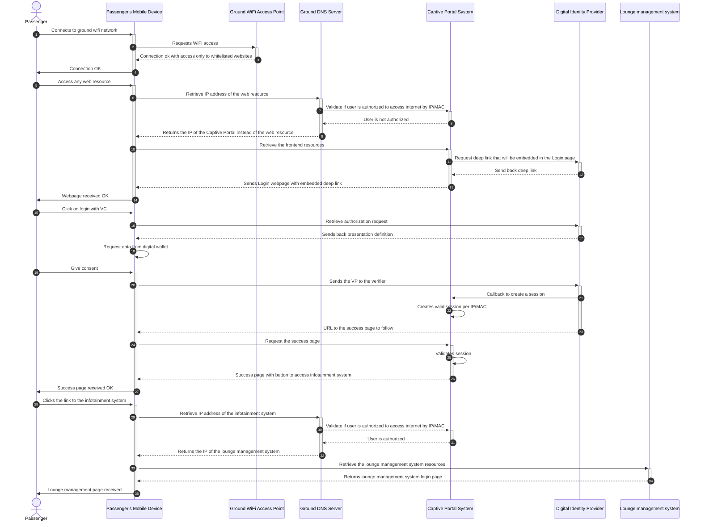
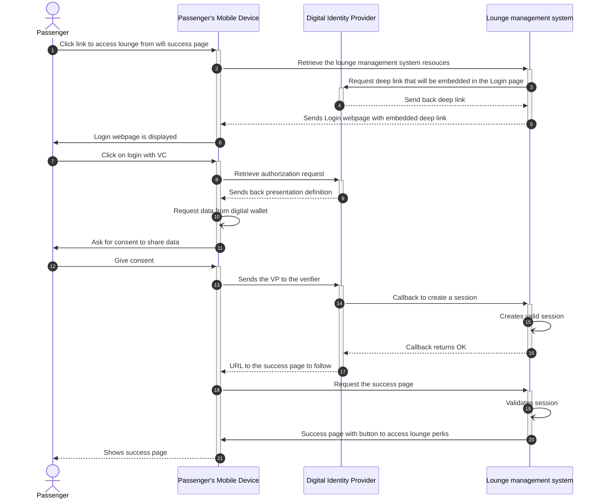
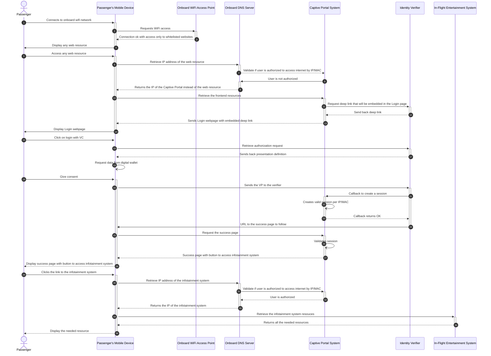
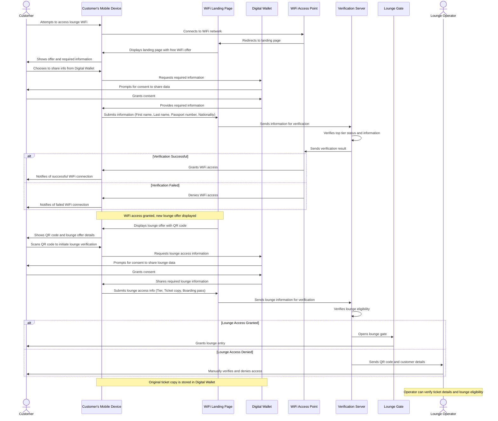

# Digital Identity B2C - FQTV Tier Mutual Recognition and Verification System using Verifiable Credentials

## System Overview

This system is designed to provide a seamless, secure, and interoperable authentication and credential verification service for airline and travel-related applications. It leverages Verifiable Credentials (VCs) technology, integrating with various identity providers and wallet solutions to offer a unified experience across multiple airlines and service providers.
Based on the provided citations, I can attempt to summarize and describe the main value proposition and to-be scenario.

**Main Value Proposition:**
The main value proposition of the current process is to enable efficient and accurate lounge check-in and access management for known customers, including self-service options using a kiosk ("totem") at the entrance of the lounge. This is achieved through the use of a centralized database (Bienvenue) that stores access data, business rules, and processes. The system also enables human agents to scan boarding passes and check tier levels, ensuring that only eligible customers can access the lounge.

**To-Be Scenario:**
The to-be scenario involves expanding the current system to include future eligibility credentials, enabling 100% self-service check for customers not known in the departure control system as eligible. This will also involve tracking all customers and their guests who access lounges, including the reason for entitlement, and keeping proof of access for further invoicing/settlement.

Additionally, the system will need to support staff in smartly clearing doubts for "unofficial" (i.e., non-tier based) proprietary eligibility, such as VIP or private programs. This will be achieved without exchanging sensitive personal customer information.

Key aspects of the to-be scenario include:

1. **Improved self-service capabilities**: enabling 100% self-service check for eligible customers not known in the departure control system.
2. **Enhanced tracking and proof of access**: keeping a record of all customers and their guests who access lounges, including the reason for entitlement.
3. **Smart clearing of doubts**: supporting staff in resolving "unofficial" eligibility cases without compromising customer data privacy.
4. **Integration with loyalty profile synchronization**: achieving recognition of tier levels through seamless synchronization of loyalty profiles.

Overall, the to-be scenario aims to further enhance the efficiency and accuracy of lounge check-in and access management, while also providing a more seamless and user-friendly experience for customers.

## Key Components

### 1. Loyalty VC Issuer

A software system that:
- Manages Decentralized Identifiers (DIDs)
- Issues Verifiable Credentials for loyalty programs
- Manages credential revocation

### 2. Trust List

A system for maintaining trust in the ecosystem:
- Allows adding and removing DIDs from the trust list
- Distributes the trust list to relevant parties

### 3. Ground Wi-Fi Captive Portal

Provides internet access to passengers:
- Requests necessary credentials
- Verifies presented credentials
- Grants or denies Wi-Fi access

### 4. Lounge Access Portal

Manages access to airline lounges:
- Generates lounge access passes based on verified credentials

### 5. Digital Wallet

A software system for users to:
- Store Verifiable Credentials
- Present VCs when requested
- Handle proof requests and generate presentations
- Manage redirects after VC presentation

### 6. Verifier Service

Responsible for:
- Generating presentation requests
- Handling wallet communication using OpenID4VC protocol
- Verifying the authenticity and trustworthiness of presented credentials

## User Flows

1. **Ground Wi-Fi Access**:
    - Passenger connects to Wi-Fi network
    - System prompts for authentication
    - Passenger opens digital wallet and presents loyalty credential
    - System verifies credential and grants/denies access

2. **Lounge Access**:
    - Similar flow to Wi-Fi access, but for entering airline lounges
    - The flow is a continuation of the ground wi-fi where at the end the user has a link to access the lounge application

3. **On board wifi access**
   - passenger tries to access onboard wifi with its mobile on airline B flight
   - passenger is asked to prove tier level to obtain free onboard wifi access
   - passenger choose to prove tier level using airline A loyalty credential
   - passenger is sharing credential from Digital Wallet
   - passenger then obtain access to Airline B in-flight wifi

## Demo User Flow
- The passenger will arrive near the lounge and will be able to connect the lounge wifi using VC.
- After wifi access the Landing Page will display to the user the elegibility to the lounge
- Another QR Code will be present and the passenger will share all information needed (tier, etc.)
- The gate will automatically open or the lounge operator will validate the access (reuse ticket reader hardware) 
    

## Key Features

- Support for multiple wallet providers (e.g., Facephi, SICP A, Dreamix, Northern Block, NeoKe)
- Offline verification capabilities for scenarios with limited connectivity
- Compliance with government regulations for logging passenger details
- Scheduled submission of keys for maintaining system security

## Integration Points

- APIs for credential requests and verifications
- OpenID4VC protocol for standardized communication between components
- Trust registries for maintaining a list of trusted credential issuers and verifiers

This system aims to streamline the passenger experience across various touchpoints in air travel while maintaining high security and interoperability standards through the use of Verifiable Credentials technology.

## Containers
- [Digital Wallet](./containers/digital-wallet/README.md) -  Facephi, Neoke
- [Loyalty VC Issuer](./containers/loyalty-vc-issuer/README.md) - Northern Block
- [Trust List](./containers/trust-list/README.md) - SICP A
- [Ground WiFi Captive Portal](./containers/ground-wifi-captive-portal/README.md) - Dreamix
- [Lounge Access Portal](./containers/lounge-access-portal/README.md) - Dreamix, Northern Block
- [Verifier Service](./containers/verifier-service/README.md) - Neoke, Sicpa, Cognizant
- [Government Logging System](./containers/government-logging-system/README.md) 

## Documentation
- [Architecture Overview](./docs/architecture/README.md)
