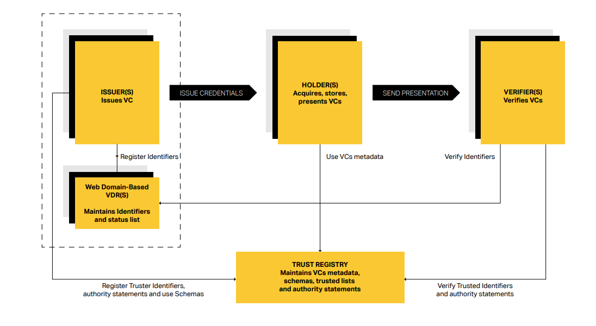
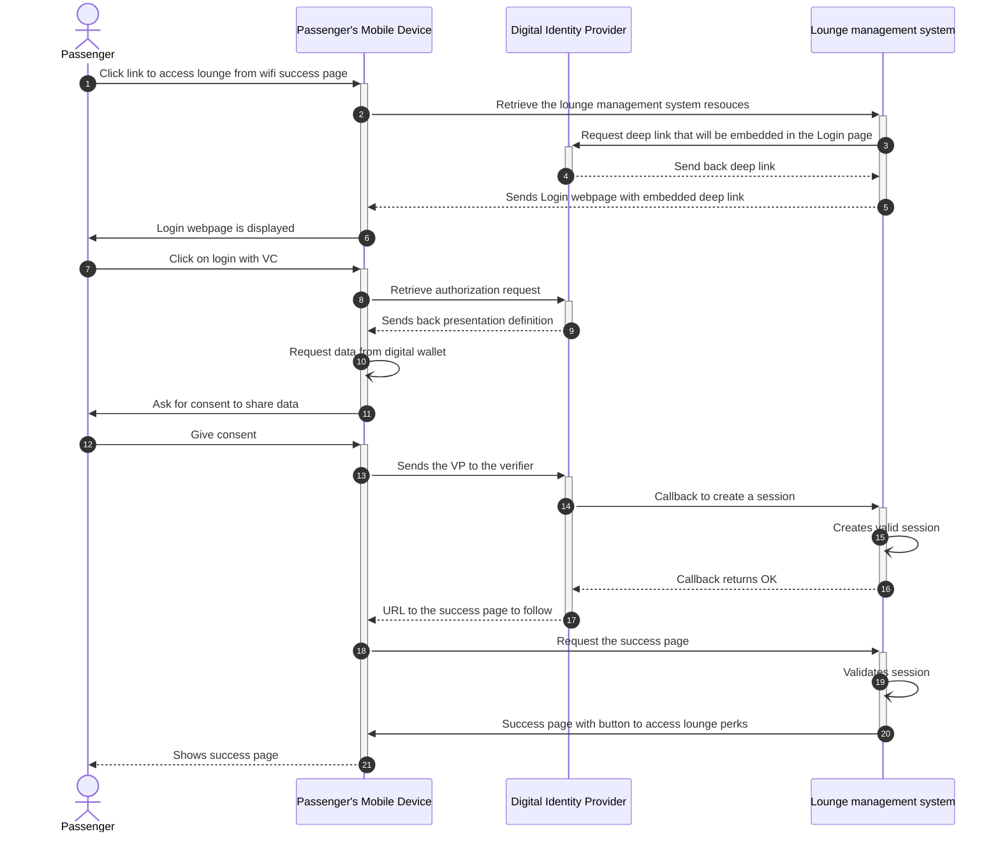
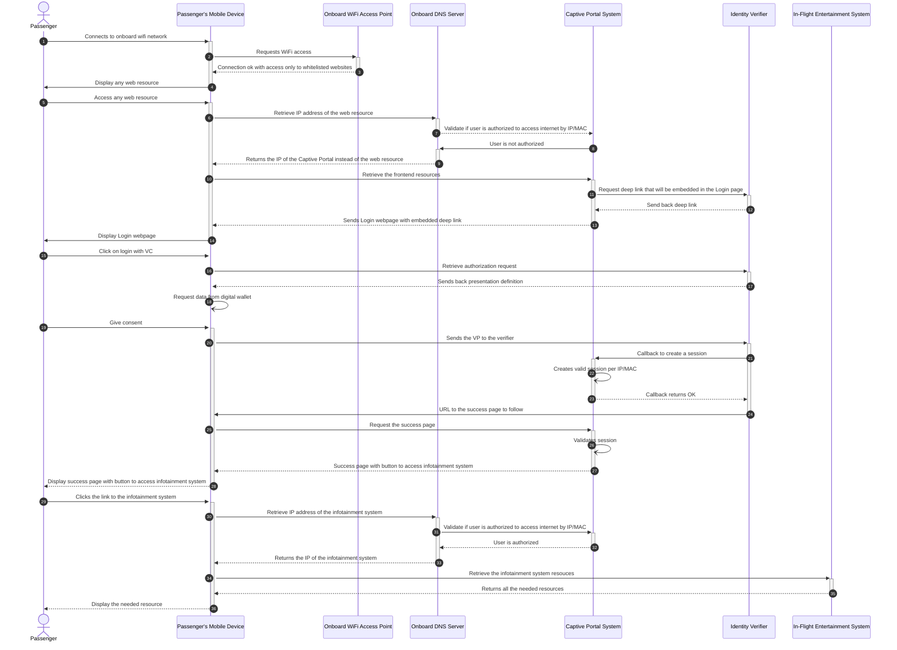
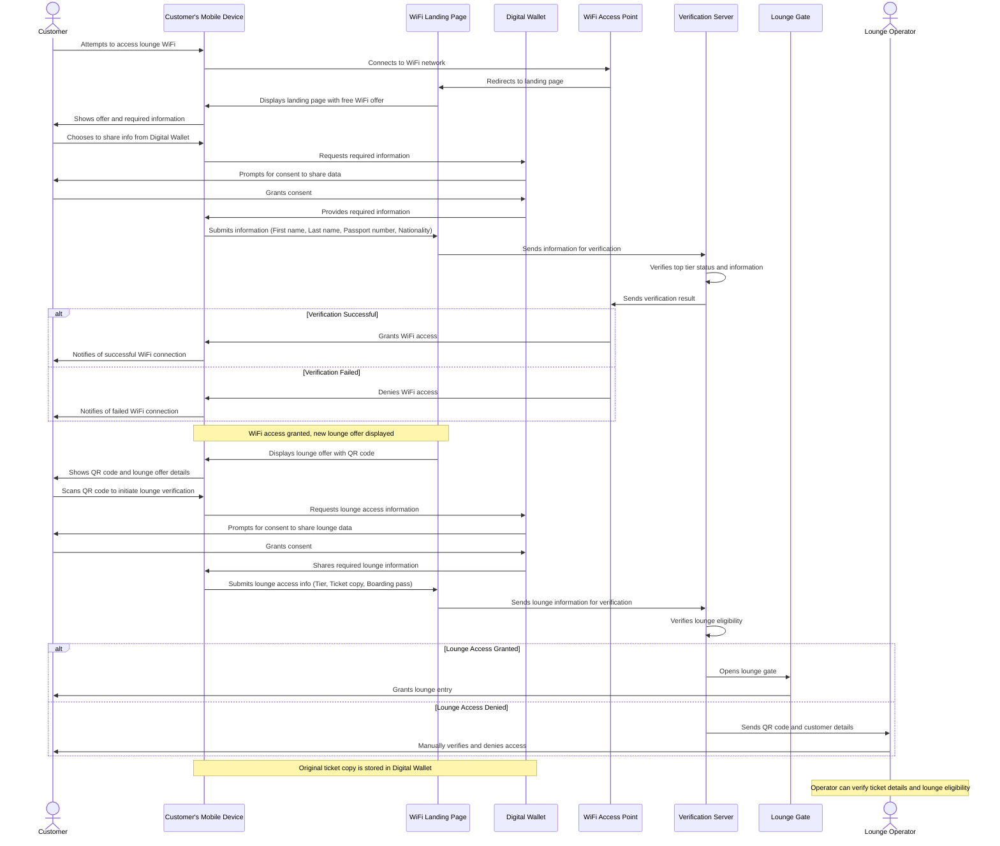
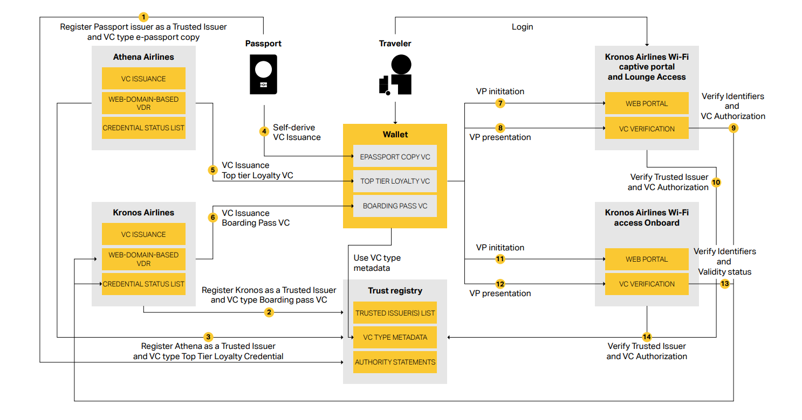

# Digital Identity B2C - FQTV Tier Mutual Recognition and Verification System  
*Using Verifiable Credentials for Seamless Passenger Authentication*

## Overview

Project 321 is a Business-to-Customer (B2C) Proof of Concept (PoC) that enhances the passenger experience by allowing secure and seamless access to airline lounges and onboard services using Verifiable Credentials (VCs) and Digital Wallets. The project explores how digital identity solutions can improve frequent flyer program interactions, reduce inefficiencies, and create a frictionless, privacy-preserving passenger journey.

# Scope
This Proof of Concept (PoC) validates key workflows demonstrating how digital identity and verifiable credentials (VCs) can enhance passenger access to airline services, including:

- Wi-Fi Authentication :Enabling frictionless access using verified identity attributes
- Lounge Entry : Automating entitlement verification based on loyalty status and ticket class
- Entitlement Management  : Ensuring precise, automated validation of passenger privileges across multiple airline partners and service providers

The PoC consists of two main use cases:

- Lounge Access Verification
- Wi-Fi Access  Onboard/In-Cabin

## Lounge Access Verification
| Step | Description |
|------|-------------------------------------------|
| 1. | Passenger selects Lounge Access on the Wi-Fi welcome page. |
| 2. | System requests boarding pass & Frequent Flyer (FFP) credentials. |
| 3. | Passenger shares credentials from Digital Wallet. |
| 4. | System verifies eligibility (ticket class, frequent flyer tier, entitlements). |
| 5. | Access approved, system generates a QR code for lounge entry. |

## Wi-Fi Access Onboard/In-Cabin
| Step | Description |
|------|-------------------------------------------|
| 1. | Passenger selects Wi-Fi network onboard. |
| 2. | Wi-Fi captive portal opens, requesting passport & FFP details. |
| 3. | Passenger shares credentials from Digital Wallet (or enters manually). |
| 4. | System verifies identity & entitlements using a trust registry. |
| 5. | Wi-Fi access granted, passenger is redirected to the welcome page. |

## Decentralized Identity Implementation & Standards

 **Issuer(s)**
Airlines, immigration authorities, or trusted government 
bodies issue Verifiable Credentials (VCs) (e.g boarding
passes, loyalty status, or passport-derived credentials) to
passengers.

**Holder(s)**
Passengers securely store their VCs in a Digital Identity
Wallet (e.g., mobile driver’s license wallets or airlinebranded apps) and selectively present them during checkin, lounge access, or Wi-Fi authentication.

**Verifiers(s)**
Airlines, airports, lounges, and onboard service providers 
validate Verifiable Presentations (VPs) to confirm eligibility
(e.g., lounge access, Wi-Fi entitlements). By leveraging
Verifiable Credentials, they can verify eligibility by
cryptographically checking the integrity and authenticity 
of the VPs while minimizing unnecessary personal data 
exposure through selective disclosure.

**Verifiable Data Registry(s)**
Maintains identifiers and status information needed to
verify the validity and revocation status of Employee VCs,
based on each travel agency’s web domain. Each travel
agency manages its own web-domain-based VDR.

**Trust Registry**
The Trust Registry maintains VC type metadata, schemas,
a trusted list of issuers, and credential issuance authority 
statements. VC type metadata and schemas define the
rules, structure, and display requirements for specific
types of Verifiable Credentials (VCs), guiding issuers,
verifiers, and wallets on how to handle and validate
credentials. The trusted list of issuers and credential 
issuance authority statements supports airlines (verifiers)
by enabling them to implement validation policies that 
ensure only trusted travel agency issuers and authorized 
credentials are accepted. 

### Interop Profile

This Proof of Concept (PoC) has developed and implemented an Interoperability Profile as a central approach to implementing decentralized digital identity standards across different technology providers.

The table below summarizes the different standards used in this PoC:

| **Component** | **Standard** | **Purpose** |
|--------------|-------------|-------------|
| **VC issuance** | [OpenID for Verifiable Credential Issuance (Implementors Draft v1)](https://openid.net/specs/openid-4-verifiable-credential-issuance-1_0-ID1.html) | Defines how an Issuer and a Wallet perform the issuance flow (pre-authorized code flow, credential offer/response). |
| **Holder binding** | SD-JWT VC | Ensures the Verifiable Credential is bound to the holder’s wallet. |
| **VC presentation** | [OpenID for Verifiable Presentations (OID4VP 20)](https://openid.net/specs/openid-4-verifiable-presentations-1_0-20.html) | Describes how a Holder presents credentials (Verifiable Presentations) to a Verifier, including request and response flows. |
| **Data format and validation rules to express VC** | [SD-JWT VC (draft-ietf-oauth-sd-jwt-vc-07)](https://datatracker.ietf.org/doc/html/draft-ietf-oauth-sd-jwt-vc-07) | Enables selective disclosure and cryptographic binding of claims in a Verifiable Credential. |
| **VC Revocation** | [OAuth 2.0 Credential Status List (draft-ietf-oauth-status-list-05)](https://datatracker.ietf.org/doc/html/draft-ietf-oauth-status-list-05) | Defines a status list mechanism for revocation checks (active/revoked) so Verifiers can ascertain a credential’s validity. |
| **Decentralized Identifiers** | [did:web](https://w3c-ccg.github.io/did-method-web) | Specifies a method for hosting DID documents on HTTPS web domains, enabling domain-based DID resolution for key material. |
| **Cryptographic Suites** | P-256 (secp256r1), ES256 (JWT) | Establishes Elliptic Curve Digital Signature (ECDSA) requirements for signing and signature validation (SHA-256 hashes). |
| **Trust Registry** | Ad-hoc | Enable airlines to implement validation policies that ensure only trusted airlines, banks, commercial partners issuers and authorized credentials are accepted in the ecosystem. |

## User Flows

1. **Ground Wi-Fi Access**:
    - Passenger connects to Wi-Fi network
    - System prompts for authentication
    - Passenger opens digital wallet and presents loyalty credential
    - System verifies credential and grants/denies access

```mermaid
sequenceDiagram
   autonumber
   actor PAX as Passenger
   participant PHONE as Passenger's Mobile Device
   participant WIFI_AP as Ground WiFi Access Point
   participant DNS as Ground DNS Server
   participant PORTAL as Captive Portal System
   participant IDP as Digital Identity Provider
   participant LMS as Lounge management system

   PAX ->>+ PHONE: Connects to ground wifi network
   PHONE ->>+ WIFI_AP: Requests WiFi access
   WIFI_AP -->>- PHONE: Connection ok with access only to whitelisted websites
   PHONE ->>- PAX: Connection OK
   PAX ->>+ PHONE: Access any web resource
   PHONE ->>+ DNS: Retrieve IP address of the web resource
   DNS ->>+ PORTAL: Validate if user is authorized to access internet by IP/MAC
   PORTAL -->>- DNS: User is not authorized
   DNS -->>- PHONE: Returns the IP of the Captive Portal instead of the web resource
   PHONE ->>+ PORTAL: Retrieve the frontend resources
   PORTAL ->>+ IDP: Request deep link that will be embedded in the Login page
   IDP -->>- PORTAL: Send back deep link
   PORTAL -->>- PHONE: Sends Login webpage with embedded deep link
   PHONE ->>- PAX: Webpage received OK
   PAX ->>+ PHONE: Click on login with VC
   PHONE ->>+ IDP: Retrieve authorization request
   IDP -->>- PHONE: Sends back presentation definition
   PHONE ->> PHONE: Request data from digital wallet
   PAX ->>+ PHONE: Give consent
   PHONE ->>+ IDP: Sends the VP to the verifier
   IDP ->>+ PORTAL: Callback to create a session
   PORTAL ->> PORTAL: Creates valid session per IP/MAC
   IDP -->>- PHONE: URL to the success page to follow
   PHONE ->>+ PORTAL: Request the success page
   PORTAL ->> PORTAL: Validates session
   PORTAL -->>- PHONE: Success page with button to access infotainment system
   PHONE ->>- PAX: Success page received OK
   PAX ->>+ PHONE: Clicks the link to the infotainment system
   PHONE ->>+ DNS: Retrieve IP address of the infotainment system
   DNS -->>+ PORTAL: Validate if user is authorized to access internet by IP/MAC
   PORTAL -->>- DNS: User is authorized
   DNS -->>- PHONE: Returns the IP of the lounge management system
   PHONE ->>+ LMS: Retrieve the lounge management system resources
   LMS -->>- PHONE: Returns lounge management system login page
   PHONE ->>- PAX: Lounge management page received.
```

2. **Lounge Access**:
    - Similar flow to Wi-Fi access, but for entering airline lounges
    - The flow is a continuation of the ground wi-fi where at the end the user has a link to access the lounge application

3. **On board wifi access**
   - passenger tries to access onboard wifi with its mobile on airline B flight
   - passenger is asked to prove tier level to obtain free onboard wifi access
   - passenger choose to prove tier level using airline A loyalty credential
   - passenger is sharing credential from Digital Wallet
   - passenger then obtain access to Airline B in-flight wifi

## Demo User Flow
- The passenger will arrive near the lounge and will be able to connect the lounge wifi using VC.
- After wifi access the Landing Page will display to the user the elegibility to the lounge
- Another QR Code will be present and the passenger will share all information needed (tier, etc.)
- The gate will automatically open or the lounge operator will validate the access (reuse ticket reader hardware) 
    

# Ecosystem Blueprint

This section outlines the high-level Proof-of-Concept (PoC) ecosystem, illustrating how a traveler can obtain verifiable credentials (VCs) from Kronos Airlines and self-derive an e-passport VC.

## Prerequisites

Before issuing and managing Verifiable Credentials, all actors must onboard the ecosystem by registering with the trust registry. This ensures that:
- **Participants (Athena Airlines, Kronos Airlines, and the self-derived e-passport issuance authority)** are registered.
- Credentials issued within the ecosystem are trusted without the need for bilateral setups between each airline partner.
- In our PoC, Kronos Airlines acts as a consumer of these VCs.

## Key Components

### Self-derived E-passport Copy Issuance Authority
- **Function:** Securely capture a traveler’s physical passport data through MRZ scanning and NFC chip reading.
- **Validation:** Performs liveness and document authentication to derive a foundational digital identity credential.
- **Outcome:** Issues an e-passport copy VC, which is stored in the traveler's digital wallet.

### Athena and Kronos Airlines (Issuers)
Athena Airlines manages the lifecycle of **Top Tier Loyalty VCs** for frequent flyer members, while Kronos Airlines handles the **Boarding Pass VCs** issued post check-in. Three key components are involved in managing the VC lifecycle:
- **VC Issuance:** Enables the creation and issuance of credentials to travelers' digital wallets.
- **Web-Domain-Based VDR:** Anchors the DID document associated with the issuer (e.g., Athena Airlines) to a controlled web domain, allowing verifiers to resolve the DID document and access verification keys.
- **Credential Status List:** Maintains the validity of all issued credentials, supporting actions like revocation (e.g., in cases of fraud or misuse).

## Passenger and Mobile Wallet

- **Function:** The digital wallet allows the passenger full control over their travel credentials (boarding passes, loyalty cards, and e-passport copy VC) securely stored on their mobile device.
- **Benefits:** 
  - Seamless access to services such as lounge entry and onboard or terminal Wi-Fi.
  - Instant verification with selective disclosure, enhancing data privacy and real-time trust across airlines, airports, and service providers.
- **Enhancement:** Future improvements include harmonizing the display of VCs (graphical elements, translations) in alignment with standardized VC visualization rules (e.g., set by IATA).

## Kronos Airlines (Verifier)

Kronos Airlines provides two key verifier components:

### 1. Portals
- **Airline Wi-Fi Captive Portal:** Designed for consuming VCs during on-ground Wi-Fi authentication, and subsequently facilitating lounge access verification.
- **Onboard Wi-Fi Captive Portal:** Ensures seamless authentication for in-flight connectivity.

### 2. Verification Service
- **Functions:**
  1. **Cryptographic Verification:** Checks the validity of the credential.
  2. **Proof Trustworthiness:** Confirms the issuer is trusted and the credential type is authorized.
  3. **Ongoing Validity:** Verifies the credential’s current status via a Credential Status List.

## Trust Registries

- **Role:** The Trust Registry enables airlines to verify that a credential originates from a trusted actor.
- **Responsibilities:**
  - Validate whether issuers are authorized to issue specific credential types (e.g., Top Tier Loyalty VC, Boarding Pass VC, e-passport copy VC).
  - Manage VC metadata, schemas, and type definitions as a centralized repository for credential specifications.
  - Ensure uniformity in issuing, presenting, and validating credentials, thereby providing a scalable and interoperable ecosystem foundation.

## Process Steps

Below is a high-level overview of the steps illustrating how airlines and trusted authorities issue credentials, how travelers present them, and how airlines verify them against the Trust Registry.

### **Prerequisite for Issuers**
- **Provisioning:** 
  - Generate signing keys and associate them with the issuer.
  - Anchor a DID using the `did:web` method and publish the DID Document containing the issuer’s public keys and metadata.

### **Steps 1-3: Register Trusted Issuer and VC Type**
- **Registration:** 
  - Athena Airlines, Kronos Airlines, and the e-passport copy issuance authority register their DIDs with the Trust Registry.
  - Request and obtain credential issuance authority to issue the respective VCs (Top Tier Loyalty VC, Boarding Pass VC, and e-Passport copy VC).

### **Step 4: Self-Derive E-passport Copy VC**
- **Data Capture:** 
  - **MRZ Scanning:** Traveler scans the Machine Readable Zone using a mobile device.
  - **NFC Chip Reading:** System reads the passport chip for biometric and biographic data.
- **Validation:** Perform liveness and document authentication.
- **Credential Derivation:** 
  - Derive the foundational digital identity.
  - Cryptographically sign the VC.
  - Include a status claim pointing to the Credential Status List.
  - Bind and securely deliver the VC to the traveler’s device.

### **Steps 5-6: VC Issuance**
- **Issuance Process:** 
  - Athena and Kronos Airlines issue their respective VCs (Top Tier Loyalty and Boarding Pass).
  - Data is obtained from airline sources, cryptographically signed, and the status is maintained via a Credential Status List.
  - The VC is securely delivered to the traveler's digital wallet.

### **Step 7: VP Initiation**
- **Access Request:** 
  - The Wi-Fi Captive Portal displays a QR code (or deep link) encoding a proof request URL.
  - The traveler scans the QR code or clicks the link to trigger the Verifiable Presentation (VP) process in their digital wallet.

### **Step 8: VP Presentation**
- **Presentation:** 
  - The traveler's digital wallet prepares a Verifiable Presentation, optionally with selective disclosure.
  - The cryptographically signed VP is sent to the airline’s verification service.

### **Step 9a: Verify Verifiable Presentation**
- **Verification Process:** 
  - The verification service resolves the issuer’s DID via `did:web`.
  - Retrieves the issuer’s DID Document to access the public key.
  - Uses the public key to cryptographically verify the integrity and authenticity of the VP.

### **Step 9b: Verify Credential Status**
- **Status Check:** 
  - Retrieve the Credential Status List from the issuer’s URL.
  - Check the corresponding status bit to confirm if the credential is active or revoked.

### **Step 10: Verify Trusted Issuer Type**
- **Final Validation:** 
  - Confirm the issuer’s DID is listed in the Trusted Issuers List in the Trust Registry.
  - Verify that the issuer is authorized to issue the credential (e.g., Top Tier Loyalty VC) by consulting the Trust Registry.
  - If all validations pass, the verification component confirms authenticity and grants the passenger Wi-Fi (or lounge/in-flight) access.

> **Note:** For onboard/in-cabin Wi-Fi access, the same process (Steps 7–10) is repeated with appropriate adjustments.

